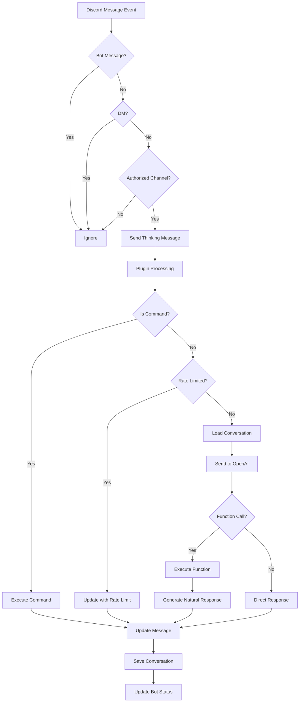
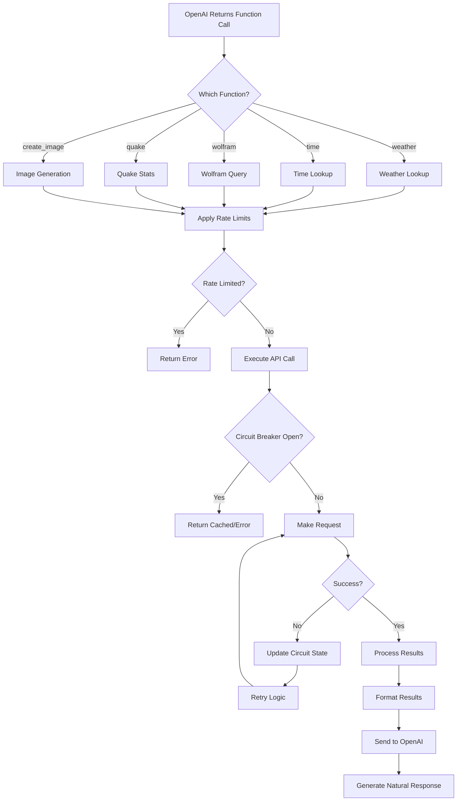
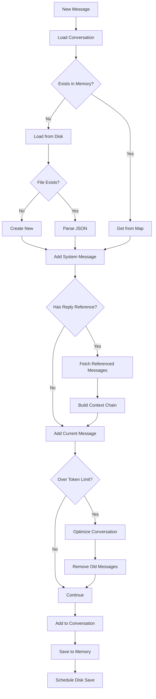
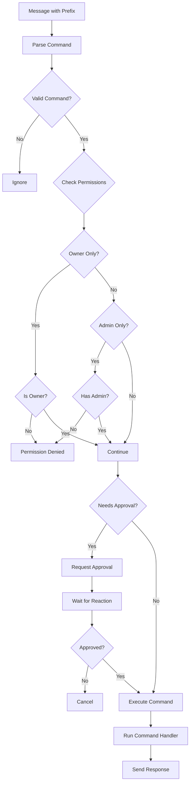
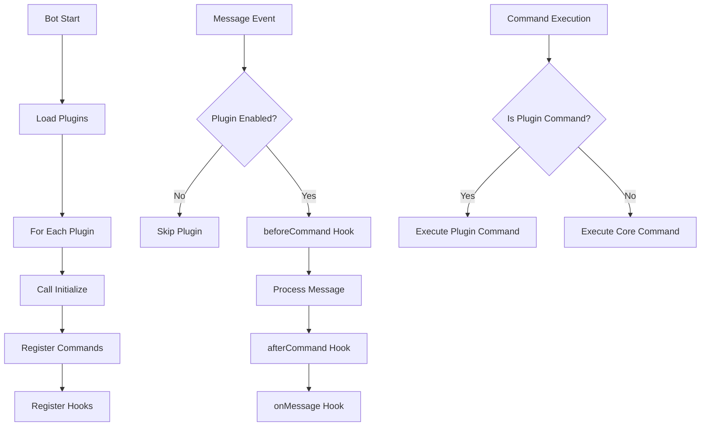
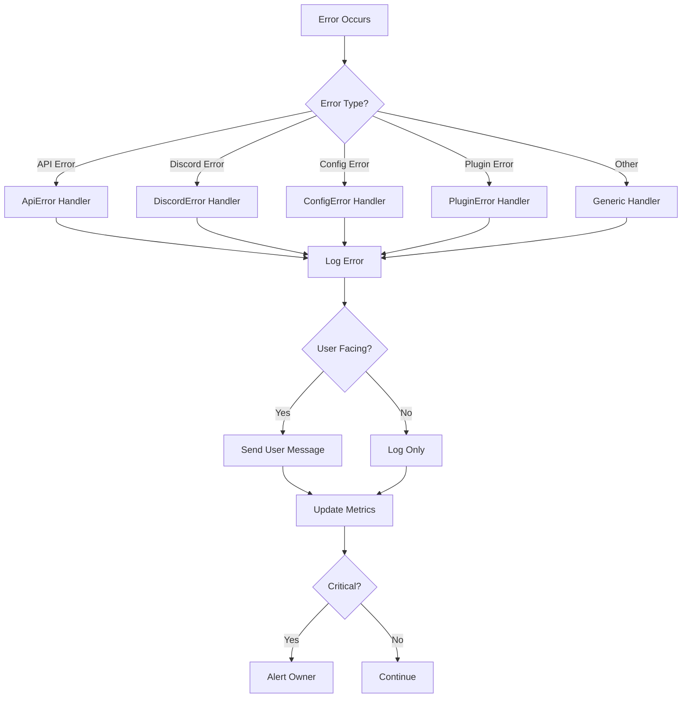

# Conversation Flow and Function Handling

This document describes the complete conversation flow and function handling architecture of Chimp-GPT.

## High-Level Message Flow



## Detailed Function Calling Flow



## Conversation Management Flow



## Command Processing Flow



## Plugin System Flow



## Error Handling Flow



## Key Components

### 1. **Message Reception** (`chimpGPT.js`)
- Handles Discord `messageCreate` events
- Validates messages (not bot, not DM, authorized channel)
- Provides immediate user feedback

### 2. **Conversation Manager** (`conversationManager.js`)
- Maintains conversation history in memory and disk
- Handles message references and reply chains
- Implements automatic pruning and optimization

### 3. **Function Handler** (`chimpGPT.js:handleFunctionCall`)
- Processes OpenAI function calls
- Applies rate limiting and circuit breaking
- Formats results for natural language generation

### 4. **Command Handler** (`commandHandler.js`)
- Parses and validates commands
- Checks permissions and approval requirements
- Routes to appropriate command modules

### 5. **Plugin Manager** (`pluginManager.js`)
- Loads and initializes plugins
- Manages plugin hooks and commands
- Handles plugin errors gracefully

### 6. **Circuit Breaker** (`circuitBreaker.js`)
- Protects external API calls
- Implements retry logic with exponential backoff
- Maintains circuit states across restarts

### 7. **Human Circuit Breaker** (`humanCircuitBreaker.js`)
- Requires Discord reaction approval for sensitive operations
- Implements timeout and cancellation
- Logs approval/rejection decisions

## Performance Optimizations

1. **Immediate Feedback**: Shows "Thinking..." message instantly
2. **Async Plugin Processing**: Plugins run in parallel
3. **Rate Limiting**: Prevents API abuse and manages costs
4. **Circuit Breaking**: Fails fast when services are down
5. **Conversation Optimization**: Prunes old messages to stay within token limits
6. **Caching**: Circuit breaker caches successful responses
7. **Batched Saves**: Conversations saved every 5 minutes instead of per-message

## Data Flow Summary

```
User Message → Discord API → Bot Client
    ↓
Validation & Initial Feedback
    ↓
Plugin Processing (async)
    ↓
Command Check → Execute Command → Response
    OR ↓
Rate Limit Check
    ↓
Load/Update Conversation Context
    ↓
Send to OpenAI API
    ↓
Function Call → Execute Function → Natural Response
    OR ↓
Direct AI Response
    ↓
Update Conversation History
    ↓
Send Final Response → Update Bot Status
```

This architecture ensures reliable, performant, and maintainable bot operations with clear separation of concerns and comprehensive error handling throughout the flow.