# PocketFlow Architecture Documentation

## Overview

PocketFlow is a graph-based conversation management system that provides a modular, maintainable, and efficient approach to handling Discord bot conversations. This document details the internal architecture, data flows, and implementation patterns.

**Version**: 2.1.6
**Philosophy**: KISS (Keep It Simple, Stupid) - Simple nodes, clear connections, minimal complexity

## Core Principles

### 1. Graph-Based Architecture
- Conversations flow through connected nodes
- Each node has a single responsibility
- Nodes connect with conditional logic
- Clear data flow from start to finish

### 2. Shared State Management
- Centralized `SharedStore` for all conversation data
- Map-based storage for O(1) lookups
- Automatic cleanup and memory management
- No filesystem dependencies during runtime

### 3. Modular Design
- Each node is independently testable
- Nodes can be composed in different ways
- Easy to add new functionality
- Clear separation of concerns

---

## Core Components

### PocketFlow Base Classes

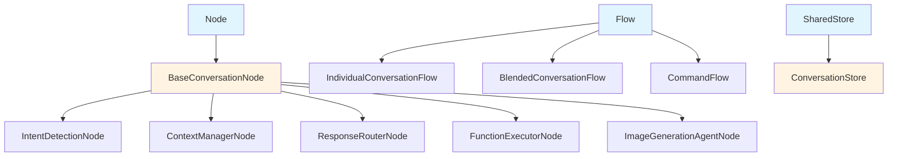

### Node → Flow → Store Relationship

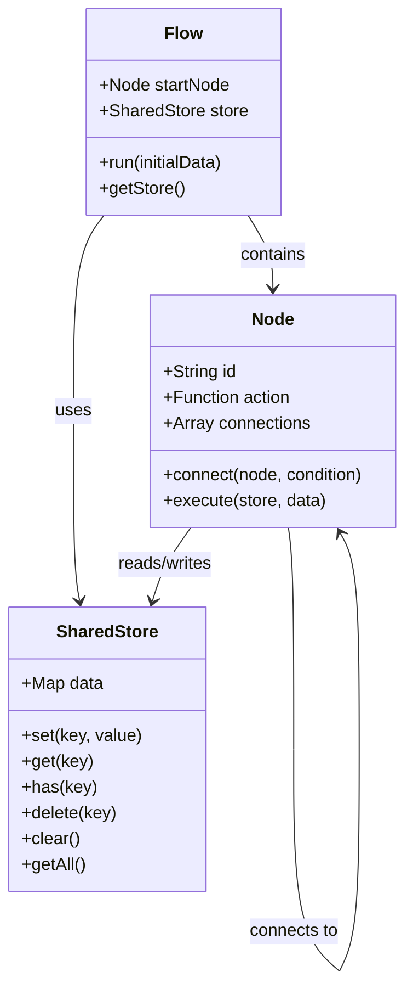

---

## Node Execution Flow

### Basic Node Execution with Error Handling

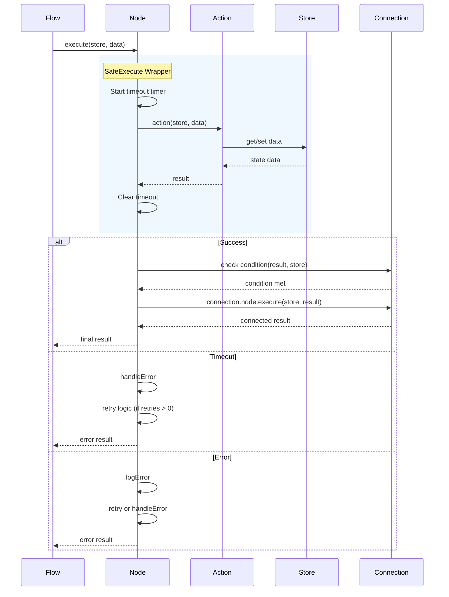

### Node Connection Patterns

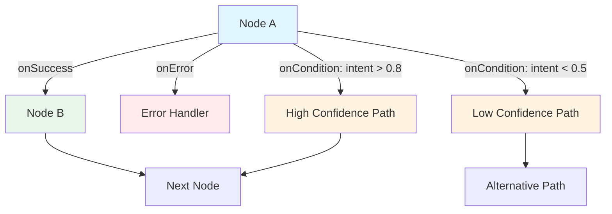

---

## Individual Conversation Flow (Detailed)

### Complete Flow Path

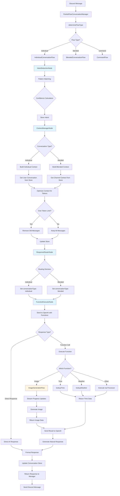

---

## Intent Detection Node

### Pattern Matching and Confidence Scoring

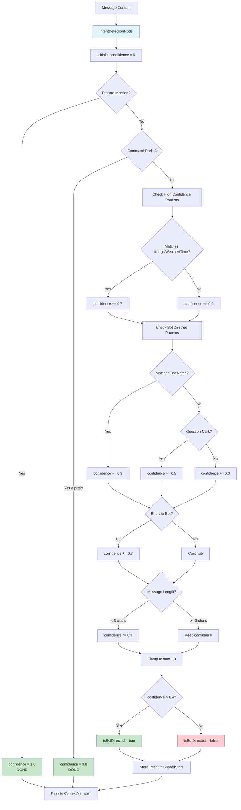

### Intent Detection Patterns

| Pattern Type | Examples | Confidence Boost |
|-------------|----------|------------------|
| Discord Mention | `@BotName` | 1.0 (absolute) |
| Command Prefix | `/help`, `!status` | 0.8 |
| High Confidence | "draw an image", "what's the weather" | +0.7 |
| Bot Directed | "chimp", "bot", "hey bot" | +0.3 |
| Questions | Ends with `?` | +0.5 |
| Reply to Bot | Message is reply to bot message | +0.3 |
| Short Messages | < 3 characters | ×0.3 (penalty) |

---

## Context Manager Node

### Context Optimization Flow

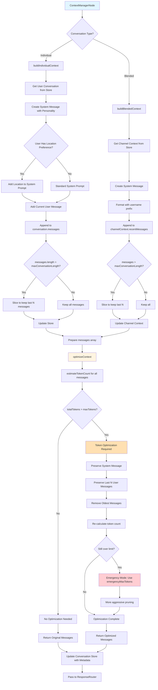

### Token Optimization Strategy

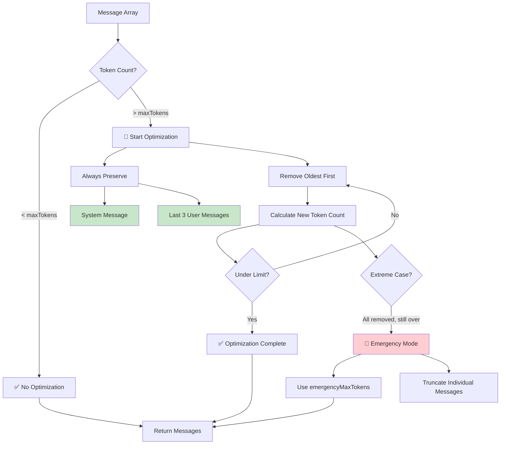

---

## Response Router Node

### Intelligent Flow Selection

```mermaid
flowchart TD
    A[ResponseRouterNode] --> B[Get message, intent, context]

    B --> C{Is Direct Message?}
    C -->|Yes| D[Route: Individual<br/>Reason: direct_message<br/>Confidence: 1.0]

    C -->|No| E{Intent Confidence?}
    E -->|>= 0.8| F[Route: Individual<br/>Reason: high_confidence_intent]
    E -->|< 0.8| G{Is Command Message?}

    G -->|Yes /! prefix| H[Route: Individual<br/>Reason: command_message<br/>Confidence: 1.0]
    G -->|No| I[analyzeChannelActivity]

    I --> J{Active Users >= 5?}
    J -->|Yes| K[Route: Blended<br/>Reason: high_channel_activity<br/>Confidence: 0.7]
    J -->|No| L{Recent Channel Conversation?}

    L -->|Yes < 5 min| M[Route: Blended<br/>Reason: ongoing_channel_conversation<br/>Confidence: 0.6]
    L -->|No| N{Intent Confidence?}

    N -->|>= 0.5| O[Route: Individual<br/>Reason: moderate_confidence_intent]
    N -->|< 0.5| P[Route: Individual (Default)<br/>Reason: default_fallback<br/>Confidence: 0.3]

    D --> Q[updateRoutingMetrics]
    F --> Q
    H --> Q
    K --> Q
    M --> Q
    O --> Q
    P --> Q

    Q --> R[Store routing decision in Store]
    R --> S[Pass to FunctionExecutor]

    style D fill:#c8e6c9
    style F fill:#c8e6c9
    style H fill:#c8e6c9
    style K fill:#fff9c4
    style M fill:#fff9c4
    style O fill:#e1f5ff
    style P fill:#ffccbc
```

### Channel Activity Analysis

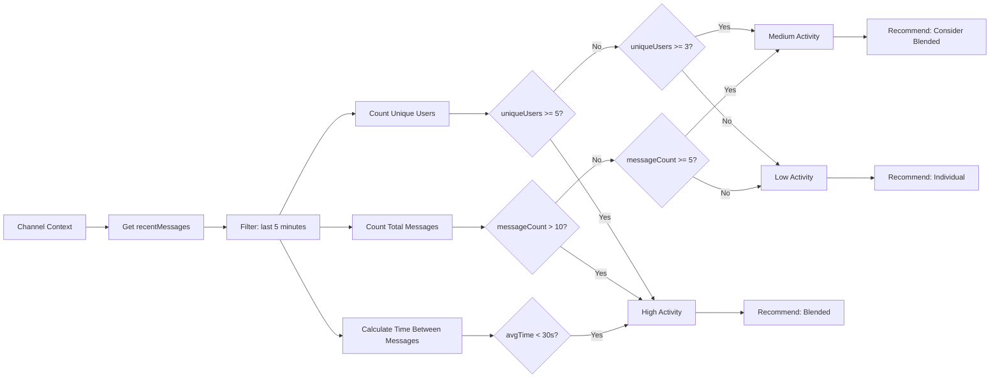

---

## Function Executor Node

### OpenAI Function Calling with Streaming

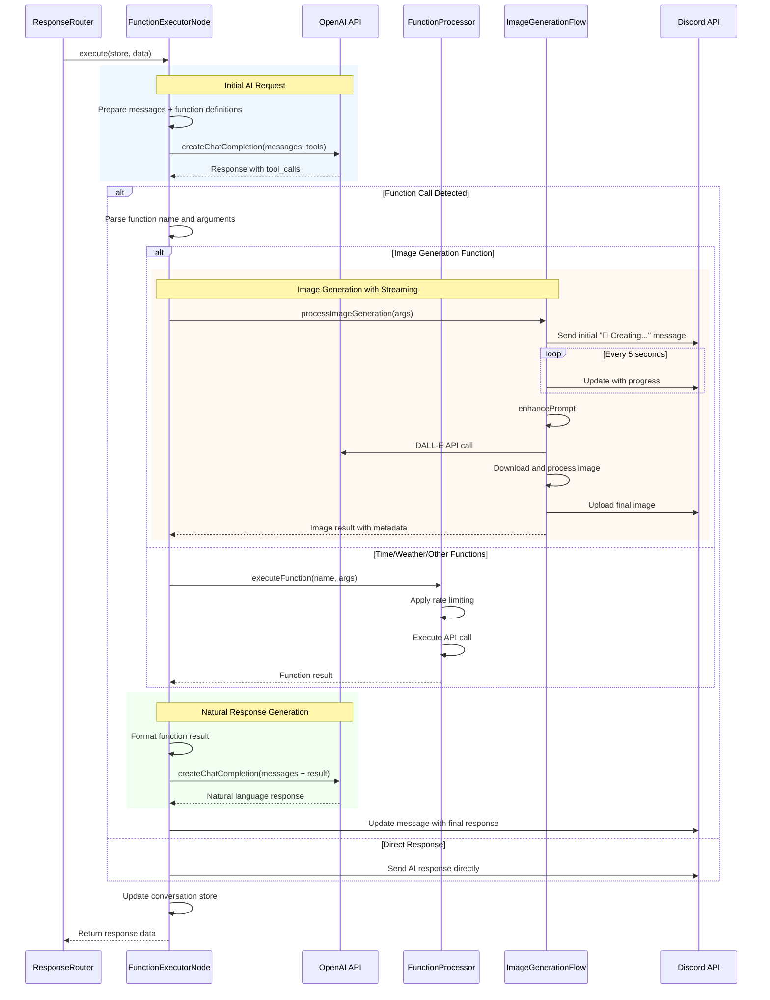

### Function Definition Structure

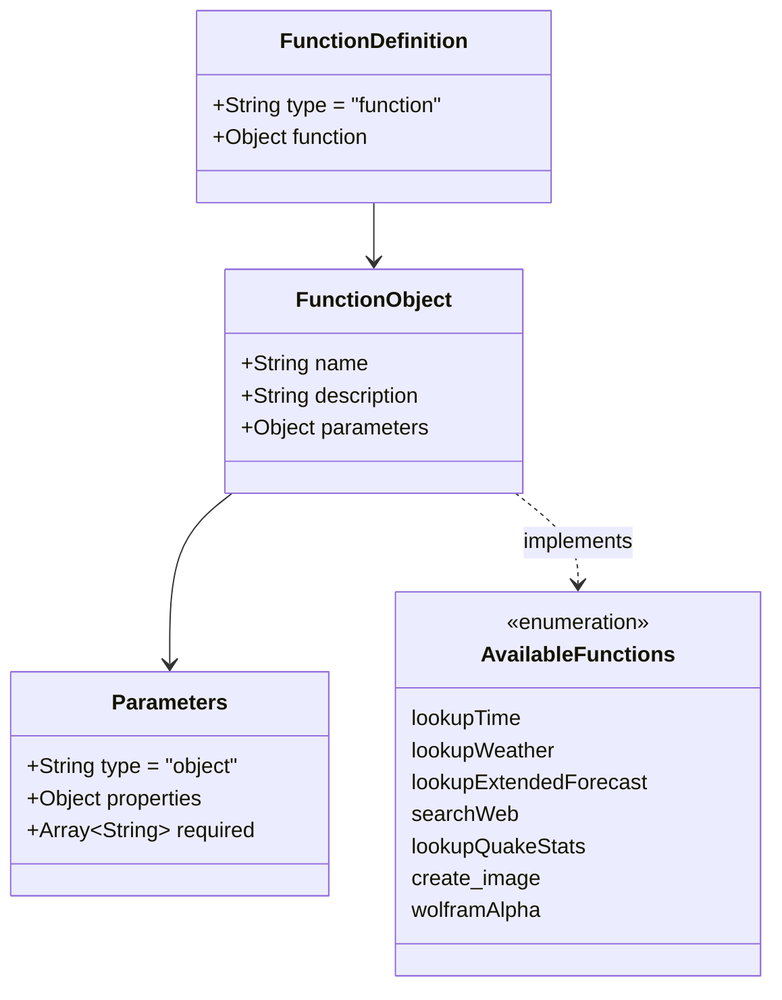

---

## Image Generation Flow (Streaming)

### State Machine with Progress Updates

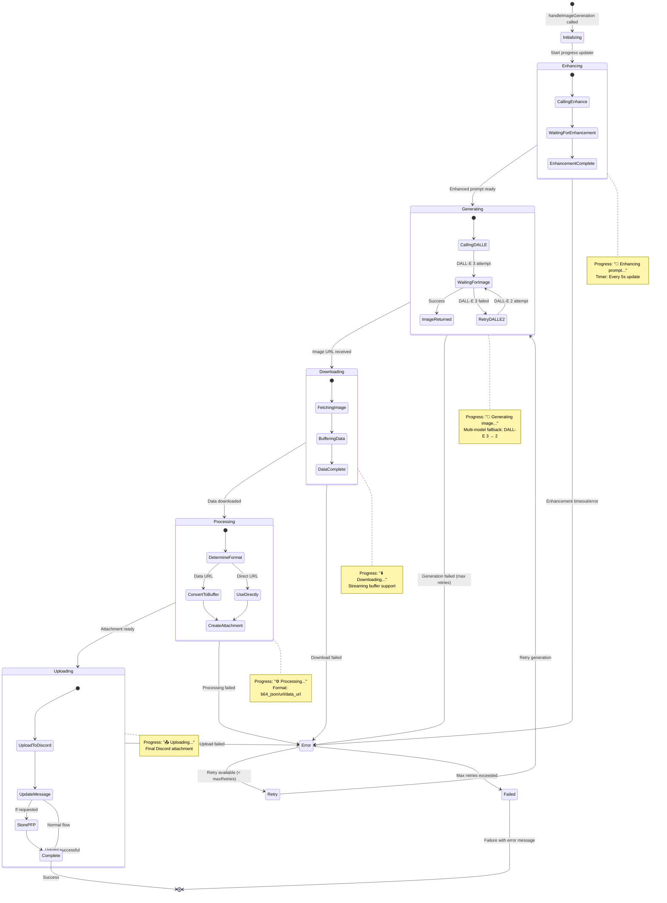

### Image Generation Progress Timeline

```mermaid
gantt
    title Image Generation Timeline (Typical ~20-30s)
    dateFormat ss
    axisFormat %Ss

    section Initialization
    Setup and validation       :a1, 00, 1s

    section Enhancement
    Enhance prompt via GPT     :a2, 01, 3s

    section Generation
    DALL-E 3 API call         :a3, 04, 15s
    Fallback to DALL-E 2      :crit, 04, 15s

    section Download
    Download image data       :a4, 19, 2s

    section Processing
    Buffer and format         :a5, 21, 2s

    section Upload
    Upload to Discord         :a6, 23, 3s

    section Updates
    Progress update 1         :milestone, 05, 0s
    Progress update 2         :milestone, 10, 0s
    Progress update 3         :milestone, 15, 0s
    Progress update 4         :milestone, 20, 0s
    Complete                  :milestone, 26, 0s
```

---

## Conversation Store (Data Model)

### Store Structure and Relationships

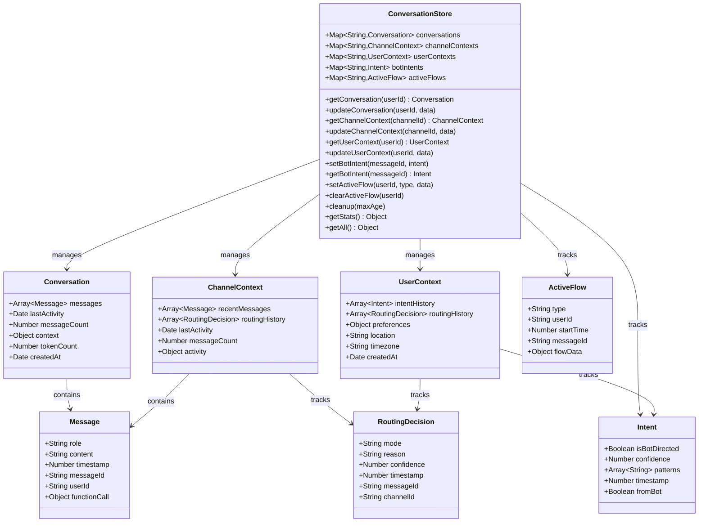

### Store Cleanup and Memory Management

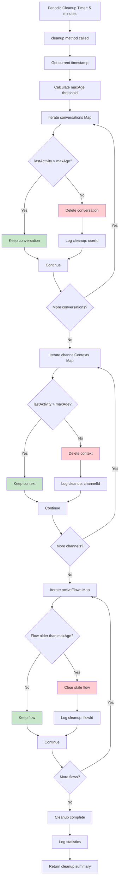

---

## Complete Data Flow Example

### Full Message Processing Journey

```mermaid
flowchart TD
    Start([User sends: 'draw an image of a sunset']) --> A[Discord messageCreate event]

    A --> B[chimpGPT.js: Message handler]
    B --> C{Is bot message?}
    C -->|Yes| End1([Ignore])
    C -->|No| D{Authorized channel?}
    D -->|No| End2([Ignore])
    D -->|Yes| E[pocketFlowAdapter.manageConversation]

    E --> F[PocketFlowConversationManager.processMessage]
    F --> G[determineFlowType: 'individual']

    G --> H[IndividualConversationFlow.processMessage]
    H --> I[Flow.run with startNode]

    I --> J[IntentDetectionNode.execute]
    J --> K[Pattern matching: 'draw' + 'image']
    K --> L[High confidence pattern matched: +0.7]
    L --> M[Final confidence: 0.7]
    M --> N[Store intent in SharedStore]
    N --> O[Pass to ContextManagerNode]

    O --> P[ContextManagerNode.execute]
    P --> Q[buildIndividualContext]
    Q --> R[Get user conversation from Store]
    R --> S[Add system message + user message]
    S --> T[Optimize for token limit]
    T --> U[Update conversation in Store]
    U --> V[Pass to ResponseRouterNode]

    V --> W[ResponseRouterNode.execute]
    W --> X[determineConversationMode]
    X --> Y{Intent confidence >= 0.8?}
    Y -->|No: 0.7| Z{Is DM?}
    Z -->|No| AA{Confidence >= 0.5?}
    AA -->|Yes: 0.7| AB[Route: Individual<br/>Reason: moderate_confidence]
    AB --> AC[Store routing decision]
    AC --> AD[Pass to FunctionExecutorNode]

    AD --> AE[FunctionExecutorNode.execute]
    AE --> AF[OpenAI API: createChatCompletion<br/>with function definitions]

    AF --> AG[OpenAI returns tool_calls:<br/>create_image]
    AG --> AH[Parse function: 'create_image']
    AH --> AI[Parameters: prompt, size, style]

    AI --> AJ[ImageGenerationFlow.processImageGeneration]

    AJ --> AK[Phase: Initializing<br/>Send Discord message:<br/>'🎨 Creating...']

    AK --> AL[Start progress updater: 5s intervals]
    AL --> AM[Phase: Enhancing<br/>Update: '🔮 Enhancing prompt...']

    AM --> AN[enhanceImagePrompt via GPT-4]
    AN --> AO[Enhanced prompt returned]

    AO --> AP[Phase: Generating<br/>Update: '🎨 Generating image...']
    AP --> AQ[Call DALL-E 3 API]

    AQ --> AR{Success?}
    AR -->|Yes| AS[Image URL returned]
    AR -->|No| AT[Fallback: DALL-E 2]
    AT --> AS

    AS --> AU[Phase: Downloading<br/>Update: '⬇️ Downloading...']
    AU --> AV[Download image data]

    AV --> AW[Phase: Processing<br/>Update: '⚙️ Processing...']
    AW --> AX[Convert to Discord attachment]

    AX --> AY[Phase: Uploading<br/>Update: '📤 Uploading...']
    AY --> AZ[Upload to Discord]

    AZ --> BA[Stop progress updater]
    BA --> BB[Update message with final image]

    BB --> BC[Return function result to FunctionExecutor]
    BC --> BD[Send function result to OpenAI]
    BD --> BE[OpenAI generates natural response:<br/>'Here's your sunset image!']

    BE --> BF[Update conversation store with assistant message]
    BF --> BG[Return to IndividualConversationFlow]

    BG --> BH[Return to PocketFlowConversationManager]
    BH --> BI[Return to pocketFlowAdapter]
    BI --> BJ[Return to chimpGPT message handler]

    BJ --> BK[Final Discord message edit]
    BK --> BL[Update bot status]
    BL --> End3([Complete])

    style K fill:#fff4e1
    style L fill:#c8e6c9
    style AG fill:#e1f5ff
    style AJ fill:#fff4e1
    style AS fill:#c8e6c9
    style BE fill:#c8e6c9
```

---

## Performance Characteristics

### Execution Time Breakdown

| Phase | Average Time | Notes |
|-------|--------------|-------|
| Intent Detection | 5-10ms | Pattern matching only |
| Context Management | 50-100ms | Includes token optimization |
| Response Routing | 5-10ms | Decision logic only |
| OpenAI Function Call | 1-3s | Network + API processing |
| Image Generation | 15-30s | DALL-E API + processing |
| Other Functions | 0.5-2s | Weather, time, search APIs |
| Natural Response | 1-2s | OpenAI text generation |
| **Total (no image)** | **2-7s** | Typical conversation response |
| **Total (with image)** | **20-35s** | Image generation flow |

### Memory Footprint

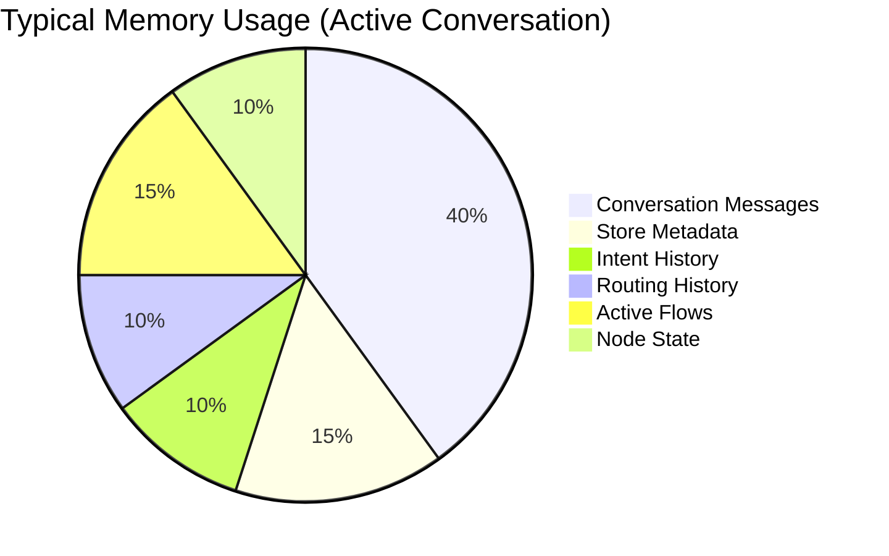

---

## Error Handling Patterns

### Error Propagation Through Nodes

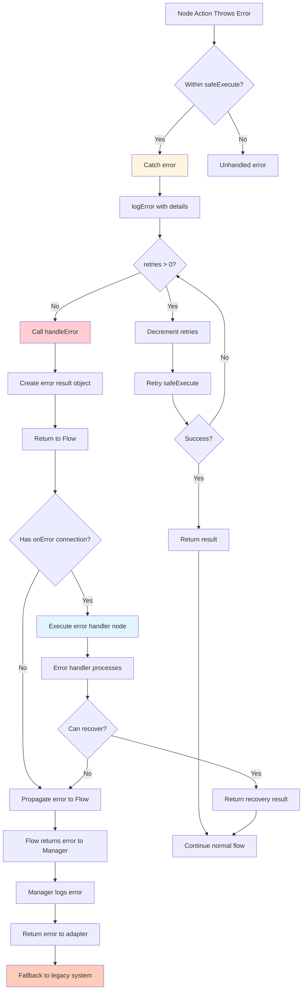

### Common Error Scenarios

| Error Type | Handling Strategy | Recovery |
|-----------|------------------|----------|
| **Timeout** | Retry with exponential backoff | 2 retries, then error |
| **OpenAI API Error** | Log, return user-friendly message | Fallback to legacy |
| **Rate Limit** | Queue or delay | Wait and retry |
| **Function Error** | Log, return function error to OpenAI | AI generates error response |
| **Store Error** | Log, use empty context | Continue with minimal context |
| **Node Error** | Retry if configured | Execute error handler node |
| **Discord Error** | Retry upload/edit | Log and alert owner |

---

## Best Practices

### 1. Node Design
✅ **Single Responsibility**: Each node does one thing well
✅ **Timeout Protection**: All async operations have timeouts
✅ **Error Handling**: Always use safeExecute wrapper
✅ **Store Updates**: Update store at node boundaries
✅ **Logging**: Use debug logging for node execution

### 2. Flow Composition
✅ **Linear Flow**: Keep flows as linear as possible
✅ **Conditional Branching**: Use onCondition for complex routing
✅ **Error Paths**: Always provide error handling paths
✅ **Store Isolation**: Each flow has its own store instance
✅ **Cleanup**: Implement cleanup for long-running flows

### 3. Store Management
✅ **Namespacing**: Use clear key names (userId, channelId)
✅ **Cleanup**: Regular cleanup of old data
✅ **Immutability**: Don't mutate stored objects directly
✅ **Validation**: Validate data before storing
✅ **Metrics**: Track store size and performance

### 4. Performance
✅ **Token Optimization**: Always optimize context before API calls
✅ **Caching**: Cache expensive computations
✅ **Parallel Processing**: Use concurrent flows when possible
✅ **Progress Updates**: Provide feedback for long operations
✅ **Monitoring**: Track execution times and success rates

---

## Comparison: PocketFlow vs Legacy

| Aspect | PocketFlow | Legacy |
|--------|-----------|--------|
| **Architecture** | Graph-based nodes | Monolithic handler |
| **Complexity** | 60% reduction | High coupling |
| **Testability** | Each node testable | End-to-end only |
| **Maintainability** | High (modular) | Medium (coupled) |
| **Performance** | Optimized routing | Always processes all |
| **Context Management** | Dynamic token optimization | Fixed pruning |
| **Error Handling** | Node-level retry + recovery | Global try-catch |
| **Extensibility** | Add new nodes easily | Modify core logic |
| **State Management** | Centralized Store | Scattered across files |
| **Memory Usage** | Efficient cleanup | Manual management |

---

## Future Enhancements

### Planned Improvements

1. **Multi-Model Support**: Route to different AI models based on intent
2. **Enhanced Caching**: Cache function results and AI responses
3. **Conversation Summarization**: Automatic long conversation summarization
4. **Sentiment Analysis**: Route based on message sentiment
5. **User Preferences**: Per-user conversation settings
6. **Analytics Dashboard**: Real-time flow performance metrics
7. **A/B Testing**: Compare different flow configurations
8. **Plugin Nodes**: Allow plugins to add custom nodes

---

## Troubleshooting Guide

### Common Issues

**Issue**: Message not being processed
**Check**: Intent detection confidence (must be > 0.4)
**Solution**: Adjust botDirectedPatterns or confidenceThreshold

**Issue**: Context too large (token limit exceeded)
**Check**: Conversation length, maxConversationLength setting
**Solution**: Reduce maxConversationLength or increase emergencyMaxTokens

**Issue**: Image generation timeout
**Check**: DALL-E API status, network connectivity
**Solution**: Increase FunctionExecutorNode timeout, check retries

**Issue**: Store growing too large
**Check**: Cleanup interval, maxAge setting
**Solution**: Reduce cleanup interval or maxAge threshold

**Issue**: Wrong flow type selected
**Check**: Response routing logs, channel activity metrics
**Solution**: Adjust routing thresholds (confidenceThreshold, blendedChannelThreshold)

---

## Code Examples

### Creating a Custom Node

```javascript
const BaseConversationNode = require('./nodes/BaseNode');
const { createLogger } = require('../../core/logger');

const logger = createLogger('CustomNode');

class CustomNode extends BaseConversationNode {
  constructor(options = {}) {
    const action = async (store, data) => {
      return await this.processCustomLogic(store, data);
    };

    super('custom_node', action, {
      timeout: 5000,
      logLevel: 'debug',
      ...options,
    });

    this.config = {
      // Custom configuration
      ...options.config,
    };
  }

  async processCustomLogic(store, data) {
    try {
      // Your custom logic here
      const result = await this.doSomething(data);

      // Update store if needed
      store.set('customData', result);

      return {
        success: true,
        result: result,
        data: data,
      };
    } catch (error) {
      logger.error('Custom logic failed:', error);
      return {
        success: false,
        error: error.message,
      };
    }
  }

  async doSomething(data) {
    // Implementation
    return data;
  }
}

module.exports = CustomNode;
```

### Building a Custom Flow

```javascript
const { Flow } = require('../PocketFlow');
const ConversationStore = require('../ConversationStore');
const CustomNode = require('../nodes/CustomNode');
const FunctionExecutorNode = require('../nodes/FunctionExecutorNode');

class CustomFlow {
  constructor(openaiClient, functionCallProcessor, options = {}) {
    this.store = new ConversationStore();
    this.options = options;

    // Create nodes
    this.customNode = new CustomNode(this.options.custom);
    this.functionNode = new FunctionExecutorNode(
      openaiClient,
      functionCallProcessor,
      this.options.function
    );

    // Set up connections
    this.customNode
      .onSuccess(this.functionNode)
      .onError(this.createErrorHandler());

    // Build flow
    this.flow = new Flow(this.customNode, this.store);
  }

  async processMessage(messageData) {
    try {
      const result = await this.flow.run({
        message: messageData.message,
        context: messageData.context,
      });

      return {
        success: true,
        result: result,
        flowType: 'custom',
      };
    } catch (error) {
      return {
        success: false,
        error: error.message,
      };
    }
  }

  createErrorHandler() {
    const BaseConversationNode = require('../nodes/BaseNode');
    return new BaseConversationNode('error_handler', async (store, data) => {
      // Handle errors
      return {
        success: false,
        error: 'Custom flow error',
        recovery: true,
      };
    });
  }

  getStore() {
    return this.store;
  }
}

module.exports = CustomFlow;
```

---

## References

- [PocketFlow Original Concept](https://github.com/yourusername/pocketflow)
- [OpenAI Function Calling Guide](https://platform.openai.com/docs/guides/function-calling)
- [Discord.js Documentation](https://discord.js.org/)
- [Conversation Flow Documentation](./CONVERSATION_FLOW.md)
- [Error Handling Guide](./ERROR_HANDLING.md)

---

**Document Version**: 1.0.0
**Last Updated**: 2025-12-27
**Maintained By**: ChimpGPT Development Team
